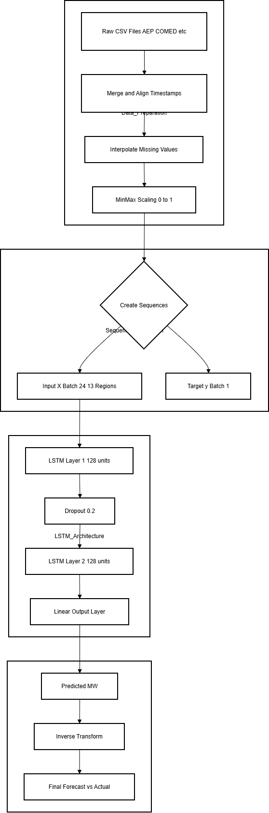

# Weather-Based Power Load Forecasting

**Credit to - https://github.com/KomalGoel18**


A deep learning project that forecasts hourly power load using a multi-region LSTM (Long Short-Term Memory) neural network. The model leverages energy consumption data from multiple PJM (Pennsylvania-New Jersey-Maryland) regions to predict power demand for a target region.

## Overview

This project implements a time series forecasting pipeline that:

- **Ingests** hourly energy consumption data from 13+ regional datasets (AEP, COMED, DAYTON, DEOK, DOM, DUQ, EKPC, FE, NI, PJME, PJMW, PJM_Load, pjm_hourly_est)
- **Preprocesses** and merges multi-region data with timestamp alignment and interpolation
- **Trains** a 2-layer LSTM model with 128 hidden units to predict the next hour's load
- **Evaluates** forecasts using RMSE, MAE, and MAPE metrics

The target region for forecasting is **PJME** (PJM East), with other regions used as auxiliary features to capture cross-regional load patterns.

## Project Structure

```
Weather-Based Power Load Forecasting/
├── weather-based-power-load-forecasting.ipynb   # Main Jupyter notebook
├── systemdiagram.drawio.png                     # Pipeline architecture diagram
├── output.png                                   # Sample forecast visualization
├── Weather-Based Power Load Forecasting Report.docx
├── requirements.txt                             # Python dependencies
├── README.md                                    # This file
└── venv/                                        # Virtual environment
```

## System Architecture

The pipeline follows four main stages:

1. **Data Preparation** — Raw CSV files → Merge & align timestamps → Interpolate missing values → MinMax scaling (0–1)
2. **Sequence Creation** — Create input sequences (24-hour lookback) and targets (1-hour ahead)
3. **LSTM Architecture** — 2 LSTM layers (128 units each), dropout (0.2), linear output layer
4. **Post-Processing & Evaluation** — Inverse transform predictions → Compare forecast vs actual



## Data Source

The project uses the [Hourly Energy Consumption](https://www.kaggle.com/datasets/robikscube/hourly-energy-consumption) dataset from Kaggle, which contains hourly power load (MW) for multiple PJM regions.

**Data files** (place in `./data/` or Kaggle input path):

- `AEP_hourly.csv`, `COMED_hourly.csv`, `DAYTON_hourly.csv`, `DEOK_hourly.csv`
- `DOM_hourly.csv`, `DUQ_hourly.csv`, `EKPC_hourly.csv`, `FE_hourly.csv`
- `NI_hourly.csv`, `PJME_hourly.csv`, `PJMW_hourly.csv`
- `PJM_Load_hourly.csv`, `pjm_hourly_est.csv`

## Requirements

- Python 3.11+
- PyTorch (CPU or CUDA)
- pandas, numpy, scikit-learn, matplotlib

## Setup

1. **Clone or download** this repository.

2. **Create a virtual environment** (recommended):

   ```bash
   python -m venv venv
   venv\Scripts\activate   # Windows
   # source venv/bin/activate   # Linux/macOS
   ```

3. **Install dependencies**:

   ```bash
   pip install -r requirements.txt
   ```

4. **Obtain the dataset** from [Kaggle](https://www.kaggle.com/datasets/robikscube/hourly-energy-consumption) and either:
   - Place CSV files in a `data/` folder and update paths in the notebook, or
   - Run the notebook on Kaggle (paths are pre-configured for Kaggle input).

## Usage

1. Open `weather-based-power-load-forecasting.ipynb` in Jupyter Notebook or JupyterLab.
2. Ensure the data paths in the `Config` class point to your dataset location.
3. Run all cells to load data, train the model, and view results.

### Configuration

Key parameters in the `Config` class:

| Parameter       | Default | Description                    |
|----------------|---------|--------------------------------|
| `SEQ_LENGTH`   | 24      | Lookback window (hours)        |
| `PREDICT_HORIZON` | 1   | Steps ahead to predict         |
| `HIDDEN_SIZE`  | 128     | LSTM hidden units              |
| `NUM_LAYERS`   | 2       | Number of LSTM layers          |
| `EPOCHS`       | 20      | Training epochs                |
| `TARGET_REGION`| PJME    | Region to forecast             |

## Model

- **Architecture**: `MultiRegionLSTM` — LSTM with configurable input size, hidden size, and layers
- **Loss**: MSE (Mean Squared Error)
- **Optimizer**: Adam
- **Metrics**: RMSE (MW), MAE (MW), MAPE (%)

## Output

The notebook produces:

- Training loss per epoch
- Final RMSE, MAE, and MAPE on the test set
- A plot comparing actual vs predicted load for the first 500 test hours
